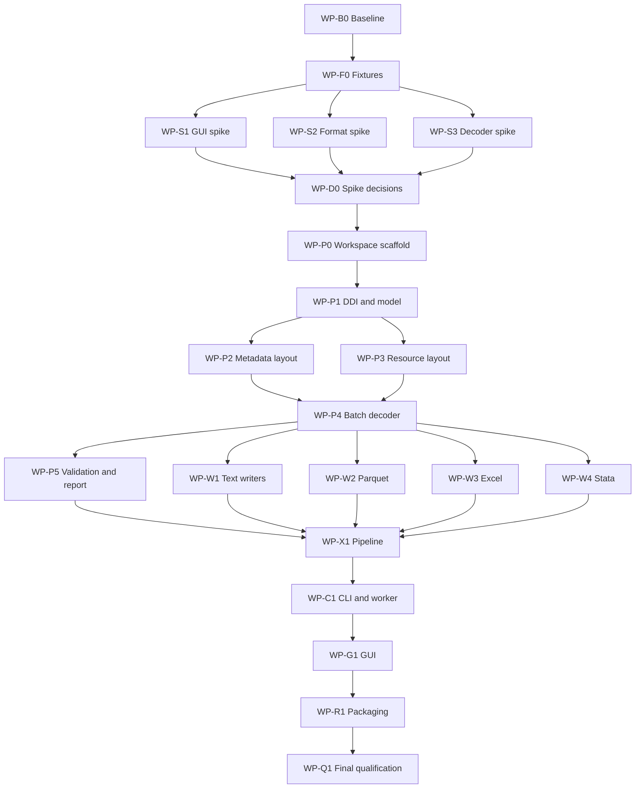

# Rust Desktop Migration Implementation Plan

**Status:** Approved architecture; implementation not started  
**Plan version:** 1.0  
**Last updated:** 2026-07-13  
**Source of truth:** This file supersedes the implementation-oriented next steps in `handoff.md`.

---

## 1. Purpose

Replace the packaged Python/PySide6 desktop application with a lightweight native Rust application while preserving the proven conversion behavior of `nesstar_converter.py`.

The completed product must:

- Be usable by non-technical researchers without a terminal.
- Run as a standalone macOS application and Linux application.
- Require no Python installation.
- Preserve conversion correctness and leading zeros.
- Support CSV, TSV, JSON, JSONL, fixed-width text, Parquet, Excel, and Stata.
- Keep memory bounded while converting large surveys.
- Provide progress, cancellation, clear errors, output discovery, and preview.

The Python converter remains the correctness oracle until all migration gates pass.

---

## 2. Non-goals

Do not include these in the initial Rust migration:

- Numeric type inference. Version 1 preserves values as strings.
- Editing Nesstar files.
- DDI authoring.
- Cloud storage or remote conversion.
- Automatic updates.
- A web application.
- A plugin framework.
- Windows release packaging. Keep the code portable to Windows, but macOS and Linux are the release targets.
- Replacing or deleting the Python implementation before parity is proven.
- Redesigning the Nesstar format based on assumptions. Port only behavior supported by code and fixtures.

Agents must not add non-goal features without an explicit plan revision.

---

## 3. Fixed architecture decisions

These decisions are approved. Agents must not change them in an implementation work package.

1. **Language:** Rust for the production parser, writers, worker, CLI, and GUI.
2. **GUI candidate:** `eframe/egui`, subject to the renderer spike in WP-S1.
3. **Process isolation:** The GUI launches the same executable in hidden worker mode. Conversion does not run in the GUI process.
4. **Source access:** Read-only memory mapping through one reviewed wrapper.
5. **Decode model:** Random-access bounded batches. Do not decode a complete block into memory.
6. **Value model:** Preserve output values as strings. Missing output is an empty string.
7. **Compatibility oracle:** Python output and existing official-export comparisons.
8. **Cancellation:** Cooperative checks plus forced worker termination from the GUI.
9. **Output safety:** Write `.partial` files and rename only after successful finalization.
10. **Networking:** The application performs no network requests.
11. **Packaging:** `cargo-packager` unless WP-S1 or WP-R1 proves it unsuitable.
12. **Python retention:** Keep `nesstar_converter.py`, Python tests, and the current GUI during migration.

Any requested change to these decisions requires an Architecture Decision Record in `docs/adr/` and orchestrator approval.

---

## 4. Success criteria

### 4.1 Correctness

- Rust matches Python cell-for-cell on approved fixtures.
- Both Python extraction paths are represented:
  - Resource-index layout.
  - Metadata-scan fallback layout.
- Column order matches DDI order.
- Leading zeros are preserved.
- Missing values are represented as empty output strings.
- Float rendering matches Python behavior.
- Output files are readable by independent tools.
- Existing Python tests continue to pass.

### 4.2 Size

Measure architecture-specific release artifacts.

- Target uncompressed application size: **60 MB or less**.
- Mandatory dependency review threshold: **75 MB**.
- Do not publish an artifact over 75 MB without a written size analysis and user approval.
- Build separate macOS ARM64 and x86-64 artifacts initially. Do not use a universal binary unless measured and approved.

### 4.3 Runtime

On representative hardware and a documented fixture:

- Startup target: less than 2 seconds.
- Idle resident memory target: less than 100 MB.
- Conversion memory must be bounded by configured batch size.
- GUI remains responsive during conversion.
- Abort request terminates the worker within 1 second.

### 4.4 Reliability

- Malformed input returns an error instead of panicking.
- Bounds are checked before every binary read.
- Final filenames never point to incomplete data.
- Cancellation removes known `.partial` files.
- Existing outputs are not overwritten without explicit confirmation.
- Unicode file paths work.
- Errors identify the source file, block, stage, and cause.

### 4.5 Accessibility

- Every control has a visible and accessible label.
- Complete keyboard operation is possible.
- Focus is visible.
- Progress is exposed to the accessibility tree.
- GUI tests query controls by role and label where supported.
- Perform a macOS screen-reader smoke test before release.

---

## 5. Existing behavior that must be preserved

The following rules come from `nesstar_converter.py`. Do not simplify them during the initial port.

### 5.1 File validation

- First eight bytes must equal `NESSTART`.
- Empty files fail with an actionable error.
- DDI XML is required.

### 5.2 DDI parsing

For each `fileDscr`, preserve:

- File ID.
- Numeric file ID used for sorting.
- Name resolved from `URI` or ID.
- Record count.
- DDI variable order.

For each variable, preserve:

- Name.
- Label.
- Declared type.
- Width.
- Decimal count.
- Range minimum and maximum.
- Referenced files.

Namespaced and non-namespaced XML must work.

### 5.3 Layout selection

For each block:

1. Attempt resource-index extraction when a resource layout exists.
2. If resource-index extraction fails and metadata-scan layout exists, use the metadata fallback.
3. If neither exists, record a block error and continue with other blocks.
4. Report the selected extraction method.

Do not remove the fallback merely because resource-index parsing succeeded on one dataset.

### 5.4 Encodings

Support all currently implemented encodings:

- Fixed-width ASCII text.
- NUL-terminated UTF-8 text slots.
- Little-endian doubles.
- Offset-encoded little-endian integers.
- Compact numeric nibble.
- Compact unsigned 8-bit.
- Compact unsigned 16-bit.
- Compact unsigned 24-bit.
- Compact unsigned 32-bit.
- Compact unsigned 40-bit.
- Compact double.

Preserve:

- All-ones missing markers.
- Nibble ordering: high nibble for even rows, low nibble for odd rows.
- Additive offsets only under the same conditions as Python.
- Duplicate resource payload detection.
- Raw-byte numeric heuristic.
- Width inference and declared-width preference.
- Cautious width reduction in the metadata-scan path.

### 5.5 Float rendering

Match Python:

- NaN becomes empty.
- Values at least `DBL_MAX * 0.99` become empty.
- Integer-looking finite values have no decimal suffix.
- Other values use at least six decimal places or the DDI decimal count, then trim trailing zeros and a trailing decimal point.

Add dedicated golden tests for negative values, zero, fractional values, large finite values, NaN, infinity, and the missing sentinel.

### 5.6 Column ordering

- Metadata-scan columns are reordered to DDI/slot order.
- Resource-index output follows DDI variable order.
- Output writers receive one stable schema order.

---

## 6. Output compatibility contract

Exact binary bytes do not need to match Python for compressed/container formats. Decoded values and documented structure must match.

### 6.1 CSV

- UTF-8 without BOM.
- Header row contains variable names.
- `,` delimiter.
- `\n` line terminator on all platforms.
- Quote only when required.
- Escape embedded quotes by doubling.
- Empty/missing values are empty fields.

### 6.2 TSV

Same as CSV except delimiter is `\t`.

### 6.3 JSON

- UTF-8.
- Array of objects.
- Keys follow schema order.
- Every value is a JSON string, including numeric codes.
- Missing values are `""`.
- Semantic equality is required; indentation does not need to match pandas.

### 6.4 JSONL

- One object per line.
- Same value rules as JSON.
- `\n` line terminator.
- No array wrapper.

### 6.5 Fixed-width text

For each column, output width is:

```text
max(DDI width or 10, variable-name length + 1) + 1
```

- First line is the variable-name header.
- Values are left aligned.
- Trailing whitespace is removed from each completed line.
- Lines end with `\n`.

### 6.6 Parquet

- All data columns use Parquet UTF-8 string logical type.
- Missing values are empty strings, not nulls, for Python compatibility.
- Column order matches the shared schema.
- Compression is Snappy.
- Output must be readable by PyArrow, DuckDB, and the Rust Parquet reader used in tests.
- File metadata may differ from pandas/PyArrow.

Do not enable unrelated Parquet features or compression codecs without size measurements.

### 6.7 Excel

Workbook structure:

- Data sheet names are `Data 1`, `Data 2`, and so on.
- Row 1 contains variable labels, falling back to variable names.
- Row 2 contains variable names.
- Data starts at row 3.
- `Variables` sheet contains metadata columns matching the Python output.
- Use constant-memory mode.
- Split blocks that exceed Excel's 1,048,576-row worksheet limit.
- Account for the two header rows when calculating rows per sheet.
- Record sheet splitting in the conversion report.

### 6.8 Stata

Initial compatibility target:

- DTA release 117.
- All variables are strings.
- Leading zeros are preserved.
- Variable labels are limited to 80 characters.
- Variable names are valid Stata names and limited to 32 characters.
- Sanitized names must be unique. Add deterministic suffixes for collisions.
- Report original-to-Stata name mapping.
- Empty values remain empty strings.

The selected DTA writer must pass WP-S2 before production use.

---

## 7. Target repository layout

The orchestrator creates shared files and module stubs before parallel production work.

```text
Cargo.toml
Cargo.lock
crates/
  nesstar-core/
    Cargo.toml
    src/
      lib.rs
      error.rs
      model.rs
      source.rs
      ddi/
      layout/
      decode/
      validation/
      formats/
      pipeline/
      report/
  nesstar-cli/
    Cargo.toml
    src/main.rs
  nesstar-gui/
    Cargo.toml
    src/
      main.rs
      app/
      worker_client/
      widgets/
fixtures/
  synthetic/
  expected/
  manifest.json
spikes/
  gui/
  formats/
  decoder/
docs/
  adr/
  spikes/
```

Do not put the Rust workspace under a nested `rust/` directory. Python and Rust coexist at repository root during migration.

---

## 8. Core API contract

The orchestrator may refine names before WP-P1 starts, but delegated agents must not independently invent competing APIs.

### 8.1 Primary types

```rust
pub struct SurveyMetadata {
    pub blocks: Vec<BlockDefinition>,
}

pub struct BlockDefinition {
    pub file_id: String,
    pub file_id_number: u32,
    pub name: String,
    pub row_count: u64,
    pub variables: Vec<VariableDefinition>,
}

pub struct VariableDefinition {
    pub name: String,
    pub label: String,
    pub declared_type: DeclaredType,
    pub ddi_width: u32,
    pub decimals: u16,
    pub range: Option<NumericRange>,
}

pub struct BlockLayout {
    pub block: BlockDefinition,
    pub method: ExtractionMethod,
    pub columns: Vec<ColumnLayout>,
}

pub enum ExtractionMethod {
    ResourceIndex,
    MetadataScan,
}

pub enum CellValue {
    Missing,
    Text(String),
}

pub struct ColumnBatch {
    pub variable_index: usize,
    pub values: Vec<CellValue>,
}

pub struct RecordBatch {
    pub start_row: u64,
    pub row_count: usize,
    pub columns: Vec<ColumnBatch>,
}
```

Writers serialize `CellValue::Missing` as an empty string. An empty decoded character slot may also become `Missing`; this matches observable Python output.

### 8.2 Error rules

Use typed errors in `nesstar-core` with `thiserror`. Errors must include structured context rather than only formatted text.

Minimum categories:

- Invalid source.
- Invalid DDI.
- Unsupported encoding.
- Out-of-bounds read.
- Invalid layout.
- Decode failure.
- Validation failure.
- Writer failure.
- Cancelled.

Use `anyhow` only in binary crates for top-level context and reporting. Do not expose `anyhow::Error` from the core public API.

### 8.3 Safety rules

- Keep memory-map creation and file metadata checks in `source.rs`.
- No other module may create a memory map directly.
- Avoid project-authored `unsafe` outside the reviewed mapping wrapper.
- All offset arithmetic uses checked operations.
- Convert between `u64` and `usize` with checked conversions.
- Never slice source bytes before validating the complete range.
- Parser functions return `Result`; malformed input must not panic.

---

## 9. Worker protocol contract

Protocol version starts at `1`.

### 9.1 Job file

The GUI writes a temporary JSON job file and invokes:

```text
NesstarConverter --worker /absolute/path/to/job.json
```

Schema:

```json
{
  "protocol_version": 1,
  "job_id": "uuid",
  "inputs": [
    {
      "nesstar": "/absolute/input.Nesstar",
      "ddi": "/absolute/ddi.xml",
      "output_directory": "/absolute/output"
    }
  ],
  "formats": ["csv", "parquet"],
  "options": {
    "batch_rows": 4096,
    "overwrite": false
  }
}
```

Requirements:

- Paths in the job file must be absolute.
- Default batch size is 4096.
- Reject unknown protocol versions.
- Reject unknown formats.
- `overwrite` defaults to false.

### 9.2 Worker events

Each `stdout` line is exactly one JSON object. Never print human logs to worker `stdout`.

Required event variants:

- `job_started`
- `file_started`
- `layout_started`
- `layout_completed`
- `block_started`
- `batch_completed`
- `format_completed`
- `block_completed`
- `warning`
- `file_failed`
- `file_completed`
- `job_cancelled`
- `job_completed`

Every event includes:

- `protocol_version`
- `job_id`
- `sequence`
- `type`
- `timestamp`

Progress events also include completed and total row counts.

### 9.3 Exit codes

- `0`: job completed; individual block warnings may exist.
- `2`: invalid CLI or job file.
- `3`: one or more input files failed.
- `4`: cancelled.
- `5`: internal failure or panic boundary.

### 9.4 Cancellation

1. GUI sends normal termination to the worker.
2. Wait up to 500 milliseconds.
3. Force kill if still running.
4. Wait for process exit.
5. Remove `.partial` files listed by the job/output resolver.
6. Display conversion as cancelled, not failed.

The worker must check cancellation between layout stages, columns, and batches.

---

## 10. Output path and overwrite policy

- Sanitize block filenames with one shared function.
- Never use source-provided `..` or path separators in output names.
- For one source and an explicitly selected output directory, write directly into that directory.
- For multiple sources sharing one output directory, create a source-stem subdirectory for each source.
- Resolve duplicate sanitized source stems with deterministic numeric suffixes.
- Before starting, calculate all final paths and detect collisions.
- Default behavior is no overwrite.
- GUI asks for confirmation when collisions exist.
- Worker enforces the job's overwrite setting; GUI confirmation alone is insufficient.
- Temporary files append `.partial` to the complete final filename.

---

## 11. Work-package dependency map



Do not start a package until all listed dependencies are approved by the orchestrator.

---

## 12. Work packages

### WP-B0 — Record baseline

**Owner:** Orchestrator  
**Dependencies:** None  
**Write scope:** `docs/baseline/` only

Tasks:

1. Record Git status without reverting user work.
2. Record Python version and dependency versions.
3. Run Python tests.
4. Record existing app size and idle behavior.
5. Record which real datasets are locally available and whether they may be redistributed.
6. Record SHA-256 hashes, not copies, for non-redistributable data.

Deliverable: `docs/baseline/python-reference.md`.

Done when the document contains exact commands, results, skipped-test reasons, and artifact sizes.

### WP-F0 — Build fixture contract

**Dependencies:** WP-B0  
**Write scope:**

- `fixtures/**`
- `tools/generate_rust_fixtures.py`
- `tests/test_rust_fixtures.py`
- `docs/fixtures.md`

Tasks:

1. Create small synthetic DDI and Nesstar fixtures for each encoding.
2. Include one metadata-scan fixture.
3. Include one resource-index fixture.
4. Include malformed/truncated variants.
5. Generate expected decoded JSON and text outputs with Python.
6. Add `fixtures/manifest.json` with hashes and expected dimensions.
7. Ensure synthetic fixtures contain no restricted survey data.

Done when fixtures regenerate deterministically and Python tests validate their hashes and expected values.

### WP-S1 — GUI and renderer spike

**Dependencies:** WP-F0  
**Write scope:**

- `spikes/gui/**`
- `docs/spikes/gui.md`

Build one representative screen with:

- File drop area.
- Two queued files.
- Format checkboxes.
- Output folder selector using `rfd`.
- Progress bar.
- Log area.
- Abort button.
- Results list.

Build two release variants:

- `eframe` with `glow`.
- `eframe` with `wgpu`.

Measure on macOS and Linux where available:

- Binary size.
- Startup time.
- Idle RSS.
- Keyboard navigation.
- Accessibility tree.
- Drag-and-drop.
- Native file dialog.

Do not implement conversion.

Done when `docs/spikes/gui.md` recommends one renderer using recorded measurements. If both variants exceed the 75 MB threshold before format dependencies, stop and request architecture review.

### WP-S2 — Format compatibility spike

**Dependencies:** WP-F0  
**Write scope:**

- `spikes/formats/**`
- `docs/spikes/formats.md`

Use a fixed all-string dataset containing:

- Leading-zero codes.
- Empty values.
- ASCII and Unicode text.
- Quotes, commas, tabs, and newlines.
- Long variable names.
- Sanitized-name collisions.
- Labels longer than 80 characters.
- Enough rows to exercise batching.

Implement only spike writers for:

- CSV.
- Parquet.
- Excel.
- Stata.

Validate with independent readers:

- Python `csv` and pandas.
- PyArrow and DuckDB for Parquet.
- openpyxl or LibreOffice for Excel.
- pandas and R `haven` for Stata when available.

Record incremental release binary size by feature.

Done when `docs/spikes/formats.md` identifies approved crates, exact Cargo features, compatibility results, and rejected alternatives. Stata remains blocked if independent round trips fail.

### WP-S3 — Decoder feasibility spike

**Dependencies:** WP-F0  
**Write scope:**

- `spikes/decoder/**`
- `docs/spikes/decoder.md`

Tasks:

1. Parse the synthetic DDI.
2. Build one metadata-scan layout.
3. Build one resource-index layout.
4. Decode bounded batches.
5. Compare every cell with fixture expected JSON.
6. Demonstrate cancellation between batches.
7. Measure peak memory at two batch sizes.

Do not build production APIs.

Done when both layout methods match expected cells and memory does not grow with total row count.

### WP-D0 — Record spike decisions

**Owner:** Orchestrator  
**Dependencies:** WP-S1, WP-S2, WP-S3  
**Write scope:** `docs/adr/**`

Required ADRs:

- GUI renderer and feature selection.
- Parquet implementation and features.
- Excel implementation.
- Stata implementation or explicit deferral.
- Batch size and memory findings.

No production Rust work begins until these ADRs are approved.

### WP-P0 — Create production workspace

**Owner:** Orchestrator  
**Dependencies:** WP-D0  
**Write scope:**

- Root `Cargo.toml`
- Root `Cargo.lock`
- `rust-toolchain.toml`
- `.cargo/**`
- Crate manifests.
- Empty module files and public API stubs.
- Rust CI skeleton.

Requirements:

- Pin a stable Rust toolchain.
- Commit `Cargo.lock` for application reproducibility.
- Configure release profile for size.
- Disable unused default features.
- Add license/dependency checking configuration.
- Create module stubs before parallel delegation.

Done when an empty workspace passes formatting, clippy, tests, and a release build.

### WP-P1 — DDI parser and shared model

**Dependencies:** WP-P0  
**Write scope:**

- `crates/nesstar-core/src/ddi/**`
- Assigned sections of `model.rs` only if explicitly granted.
- DDI-specific tests.

Implement namespaced and non-namespaced parsing with `quick-xml`.

Done when synthetic DDI fixtures match Python's parsed model exactly.

### WP-P2 — Metadata-scan layout

**Dependencies:** WP-P1  
**Write scope:**

- `crates/nesstar-core/src/layout/metadata_scan/**`
- Metadata-layout tests.

Port:

- Metadata section discovery.
- Slot counting.
- Slot parsing.
- DDI-to-slot matching.
- Binary-width calculation.
- Cautious width reduction.

Done when layout offsets, widths, names, and ordering match Python fixtures.

### WP-P3 — Resource-index layout

**Dependencies:** WP-P1  
**Write scope:**

- `crates/nesstar-core/src/layout/resource_index/**`
- Resource-layout tests.

Port resource-index parsing and variable lookup. Preserve duplicate-payload metadata needed by the decoder.

Done when resource ranges and format codes match Python fixtures.

### WP-P4 — Source wrapper and batch decoder

**Dependencies:** WP-P2, WP-P3  
**Write scope:**

- `crates/nesstar-core/src/source.rs`
- `crates/nesstar-core/src/decode/**`
- Decoder tests.

Implement all encodings and bounded batch reads. Add checked arithmetic and malformed-range tests.

Done when every fixture cell matches expected JSON for multiple batch sizes, including batch size 1 and a size larger than the block.

### WP-P5 — Streaming validation and reports

**Dependencies:** WP-P4  
**Write scope:**

- `crates/nesstar-core/src/validation/**`
- `crates/nesstar-core/src/report/**`
- Related tests.

Validation must aggregate without retaining all rows:

- Expected versus actual row count.
- Column count.
- All-empty columns.
- Numeric range violations where applicable.
- Per-block warnings and failures.

Add versioned report serialization.

Done when reports are deterministic except timestamps and absolute paths.

### WP-W1 — Text writers

**Dependencies:** WP-P4  
**Write scope:**

- `crates/nesstar-core/src/formats/csv.rs`
- `crates/nesstar-core/src/formats/json.rs`
- `crates/nesstar-core/src/formats/fwf.rs`
- Text-writer tests.

Implement CSV, TSV, JSON, JSONL, and FWF according to Section 6.

Done when outputs match golden files or semantic JSON expectations across batch sizes.

### WP-W2 — Parquet writer

**Dependencies:** WP-P4 and approved Parquet ADR  
**Write scope:**

- `crates/nesstar-core/src/formats/parquet.rs`
- Parquet tests.

Use only ADR-approved features. Preserve all-string schema and empty strings.

Done when PyArrow, DuckDB, and Rust independently read matching values and column order.

### WP-W3 — Excel writer

**Dependencies:** WP-P4 and approved Excel ADR  
**Write scope:**

- `crates/nesstar-core/src/formats/excel.rs`
- Excel tests.

Use constant-memory mode and implement deterministic sheet splitting.

Done when workbook structure, metadata, Unicode, labels, and boundary row counts pass independent reads.

### WP-W4 — Stata writer

**Dependencies:** WP-P4 and approved Stata ADR  
**Write scope:**

- `crates/nesstar-core/src/formats/stata.rs`
- Stata tests.

Do not begin if WP-S2 left Stata blocked.

Done when independent readers validate values, labels, release, leading zeros, Unicode policy, and collision-safe names.

### WP-X1 — Conversion pipeline

**Dependencies:** WP-P5 and WP-W1 through WP-W4, except explicitly deferred formats  
**Write scope:**

- `crates/nesstar-core/src/pipeline/**`
- Pipeline integration tests.

Responsibilities:

- Resolve layouts with fallback.
- Calculate all output paths before writing.
- Detect collisions.
- Create and clean partial files.
- Decode batches.
- Feed validators and writers.
- Emit typed progress events.
- Continue other blocks after a recoverable block failure.
- Finalize and atomically rename outputs.

Done when cancellation, block failure, writer failure, overwrite protection, and successful multi-format conversion have integration tests.

### WP-C1 — CLI and worker protocol

**Dependencies:** WP-X1  
**Write scope:**

- `crates/nesstar-cli/**`
- Shared protocol module assigned by orchestrator.
- CLI tests.

Commands:

- `info`
- `convert`
- `formats`
- `validate` if parity requirements are complete.
- Hidden `--worker <job-file>` mode.

Done when protocol events, exit codes, malformed job handling, cancellation, and human CLI output pass tests. Worker `stdout` must contain JSONL only.

### WP-G1 — Production GUI

**Dependencies:** WP-C1 and approved GUI ADR  
**Write scope:** `crates/nesstar-gui/**`

Implement screens and state transitions:

- Empty queue.
- Files queued with DDI status.
- Ready to convert.
- Converting.
- Cancelling.
- Completed with successes.
- Completed with partial failures.
- Fatal failure.

Required features:

- Drag-and-drop.
- Browse files.
- DDI auto-detection.
- Manual DDI selection.
- Format selection.
- Output resolution and collision confirmation.
- Worker launch and JSONL parsing.
- Progress and logs.
- Abort.
- Open output folder.
- Preview first 20 rows through Rust decoding, not pandas or full output reads.
- Accessible labels and keyboard operation.

Done when GUI state tests pass and manual smoke tests work on macOS and Linux.

### WP-R1 — Packaging and CI

**Dependencies:** WP-G1  
**Write scope:**

- `Packager.toml`
- Rust release workflows.
- Packaging scripts.
- Icons and packaging metadata.
- `docs/releasing-rust.md`

Artifacts:

- macOS ARM64 `.app` and DMG.
- macOS x86-64 `.app` and DMG.
- Linux x86-64 AppImage.
- Optional Linux `.deb`.

CI must:

1. Run format, clippy, unit, fixture, and integration tests.
2. Build release artifacts.
3. Run the packaged executable's `formats` command.
4. Convert a synthetic fixture with the packaged executable.
5. Verify artifact size budget.
6. Publish checksums.

Do not require signing secrets for pull-request CI. Release signing/notarization runs only when secrets are configured.

### WP-Q1 — Final qualification

**Owner:** Orchestrator and reviewer  
**Dependencies:** WP-R1  
**Write scope:** Qualification reports and necessary focused fixes.

Run:

- Full Rust tests.
- Existing Python tests.
- Synthetic parity.
- Available real-data parity.
- Independent format reads.
- Malformed-input suite.
- Cancellation tests.
- Size and memory benchmarks.
- macOS and Linux packaged smoke tests.
- Accessibility smoke test.
- Dependency license review.

The Python desktop release is retired only after WP-Q1 is approved.

---

## 13. Standard validation commands

Run from repository root unless a work package says otherwise.

### Python reference

```bash
python -m pytest -q
python -m compileall -q gui nesstar_converter.py
```

### Rust required checks

```bash
cargo fmt --all -- --check
cargo clippy --workspace --all-targets --all-features -- -D warnings
cargo test --workspace --all-features
cargo build --workspace --release
```

### Dependency inspection

```bash
cargo tree --workspace
cargo tree --workspace --duplicates
```

If configured in WP-P0:

```bash
cargo deny check
```

Agents must report the exact commands they ran. Do not state that validation passed if a command was not run.

---

## 14. Agent execution rules

Every delegated agent receives:

- Work-package ID.
- Dependencies already completed.
- Exact write scope.
- Required source files to read.
- Acceptance criteria.
- Validation commands.

Every delegated agent must follow this sequence:

1. Read this plan.
2. Read only relevant source and prerequisite ADRs.
3. Inspect Git status before editing.
4. Confirm that required dependency work exists.
5. Edit only the assigned write scope.
6. Do not rename shared APIs.
7. Do not add dependencies outside an approved ADR.
8. Add tests with implementation.
9. Run focused tests.
10. Run required workspace checks when feasible.
11. Return a summary containing changed files, decisions, commands, results, and remaining risks.

Agents must not:

- Commit or create branches.
- Revert unrelated user changes.
- Modify another agent's write scope.
- Replace meaningful behavior to silence a diagnostic.
- Skip tests because implementation "looks correct."
- Claim parity without comparing values.
- Add `unsafe` outside the approved source wrapper.
- Add async runtimes without an ADR.
- Add network behavior.
- Delete the Python implementation.

---

## 15. Orchestrator review checklist

Before accepting an agent's work:

### Scope

- Did it modify only assigned paths?
- Did it preserve user changes?
- Did it add unnecessary dependencies or features?

### Correctness

- Are offsets and lengths checked?
- Does it handle empty and malformed input?
- Are tests based on observable behavior rather than implementation details?
- Does parity compare values and ordering?

### Resource use

- Does memory scale with batch size rather than total rows?
- Are default features minimized?
- Does the binary-size report include this dependency?

### Maintainability

- Are public types documented?
- Are errors typed and contextual?
- Are heuristics named and tested?
- Is shared behavior implemented once?

### Validation

- Were focused tests run?
- Were workspace checks run?
- Are failures and skipped tests explained?

Reject work that violates fixed architecture decisions even if its local tests pass.

---

## 16. Dependency policy

Approved dependency categories, subject to spike ADRs:

- XML: `quick-xml`.
- Serialization: `serde`, `serde_json`.
- Errors: `thiserror`; `anyhow` in binaries only.
- Mapping: `memmap2` behind the reviewed source wrapper.
- CLI: `clap`.
- GUI: `eframe`, `egui`, `egui_extras`, `rfd` with minimal features.
- Text formats: `csv` and standard library I/O.
- Parquet: Apache Rust `parquet` with minimal approved features.
- Excel: `rust_xlsxwriter` with constant-memory feature.
- Stata: only the implementation approved by the Stata ADR.
- IDs: `uuid` only if its measured cost is acceptable; otherwise generate job IDs using standard facilities.
- Timestamps: use a minimal crate or standard-library representation chosen in WP-P0.

Do not add:

- Tokio or another async runtime unless an ADR proves it necessary.
- A database.
- A WebView.
- A full data-frame library.
- Polars.
- Reqwest or another HTTP client.
- Multiple logging frameworks.
- Multiple CLI parsers.

Commit `Cargo.lock`. Use exact lockfile resolution for release builds.

---

## 17. CI test tiers

### Tier 1 — Every change

- Rust format.
- Clippy.
- Rust unit tests.
- Synthetic fixture tests.
- Python unit tests that do not require private data.

### Tier 2 — Pull requests affecting conversion

- Packaged synthetic conversion.
- Independent output-reader tests.
- Cancellation and malformed input.
- Dependency-size comparison.

### Tier 3 — Protected or local real-data validation

- Cell-level comparisons against available official exports.
- Both layout strategies.
- Large-data memory benchmark.

Real restricted datasets must not be uploaded to public CI. Use local validation or appropriately protected storage with explicit authorization.

### Tier 4 — Release

- Architecture-specific package builds.
- Artifact smoke tests.
- Size limits.
- Checksums.
- Signing and notarization where configured.

---

## 18. Stop conditions

Stop implementation and return to architecture review if any occurs:

- GUI-only release artifact exceeds 75 MB.
- No Stata implementation passes independent readers.
- Rust decoder differs from Python on unexplained cells.
- Memory grows proportionally with total block size.
- A required extraction heuristic cannot be represented safely.
- Real data reveals an unsupported layout that invalidates the batch model.
- Linux packaging requires an undeclared heavy runtime.
- Accessibility is unusable for the primary workflow.
- A dependency has an incompatible license.

Do not work around a stop condition by silently dropping a required feature.

---

## 19. Completion definition

The migration is complete only when:

- WP-Q1 is approved.
- Rust packages pass correctness, size, runtime, reliability, and accessibility gates.
- User-facing documentation points to Rust downloads.
- Python remains available as a reference or legacy CLI for at least one release cycle.
- A rollback path to the last Python desktop release is documented.

Until then, describe the Rust application as experimental or in migration.
