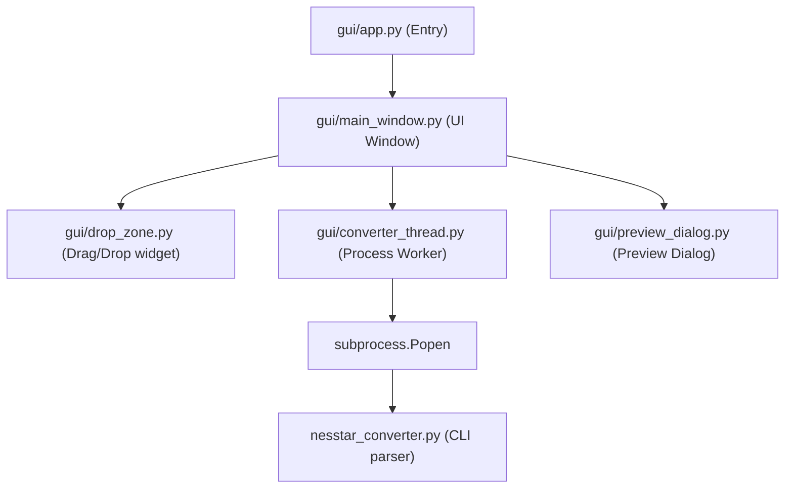

# Handoff Report: Nesstar Converter Desktop App

## Mission & Goal
Build a modern, cross-platform standalone Desktop GUI App (macOS `.app` and Linux binary) for the `nesstar-converter` repository. The target audience is non-technical researchers who need to convert proprietary Nesstar binary survey files to open formats (CSV, Parquet, Stata, Excel, etc.) without using terminal commands.

---

## Current Status (What is Done)
1. **PySide6 Desktop Application**:
   - Created the desktop app inside the [`gui/`](file:///Users/abhishekmaurya/nesstar-convertor/gui/) package.
   - Built with a clean, flat light-theme styling ([`gui/styles.py`](file:///Users/abhishekmaurya/nesstar-convertor/gui/styles.py)) and embedded SVG icons ([`gui/resources.py`](file:///Users/abhishekmaurya/nesstar-convertor/gui/resources.py)).
   - Supports drag-and-drop file queuing ([`gui/drop_zone.py`](file:///Users/abhishekmaurya/nesstar-convertor/gui/drop_zone.py)) and directory selection.
   - Includes real-time console log display, progress indicators, and an interactive data table preview of the first 20 rows of converted datasets ([`gui/preview_dialog.py`](file:///Users/abhishekmaurya/nesstar-convertor/gui/preview_dialog.py)).

2. **DDI XML Auto-Detection**:
   - Implemented hierarchical auto-detection that searches the `.Nesstar` directory and its parent folder for matching metadata files (e.g. `ddi.xml` or custom stems like `DDI-IND-CSO-PLFS-2017-18.xml`), specifically accommodating MoSPI's dataset structures.

3. **Background Offloading & Abort Functionality**:
   - Refactored [`gui/converter_thread.py`](file:///Users/abhishekmaurya/nesstar-convertor/gui/converter_thread.py) to execute the parser CLI in a separate Python subprocess using `subprocess.Popen`.
   - Added an **"Abort"** button to the GUI. If clicked, the thread immediately kills the underlying subprocess. This offloads the resource footprint from the main GUI thread and guarantees instant cancellation.

4. **Standalone Builds & CI/CD**:
   - Standalone macOS bundle (`dist/Nesstar Converter.app`, 252 MB) compiles, launches, and operates correctly.
   - Added a PyInstaller specification ([`gui/nesstar_converter.spec`](file:///Users/abhishekmaurya/nesstar-convertor/gui/nesstar_converter.spec)) that handles macOS directory bundling and Linux single-file compilation (`--onefile`).
   - Created a GitHub Actions workflow ([`.github/workflows/build-gui.yml`](file:///Users/abhishekmaurya/nesstar-convertor/.github/workflows/build-gui.yml)) to build and release standalone binaries for both platforms automatically when a version tag (`v*`) is pushed.

---

## Technical Architecture

---

## File Structure Reference
* [`gui/app.py`](file:///Users/abhishekmaurya/nesstar-convertor/gui/app.py): Bootstraps the application.
* [`gui/main_window.py`](file:///Users/abhishekmaurya/nesstar-convertor/gui/main_window.py): Implements layout and handles button slots, list widget sizing, and validation.
* [`gui/converter_thread.py`](file:///Users/abhishekmaurya/nesstar-convertor/gui/converter_thread.py): Manages the subprocess execution, captures real-time console messages, and processes cancels.
* [`gui/build_mac.sh`](file:///Users/abhishekmaurya/nesstar-convertor/gui/build_mac.sh) / [`gui/build_linux.sh`](file:///Users/abhishekmaurya/nesstar-convertor/gui/build_linux.sh): Clean environment build scripts.

---

## Next Steps

The Python/PySide6 app is now the reference implementation for a native Rust migration. The approved architecture, phased work packages, compatibility contracts, validation gates, and agent execution rules are defined in [`docs/RUST_MIGRATION_PLAN.md`](docs/RUST_MIGRATION_PLAN.md).

Do not begin the production rewrite before completing and reviewing the three required spikes:

1. GUI renderer and packaging measurements.
2. Output-format compatibility, especially Stata.
3. Bounded decoder feasibility for both binary layout strategies.
