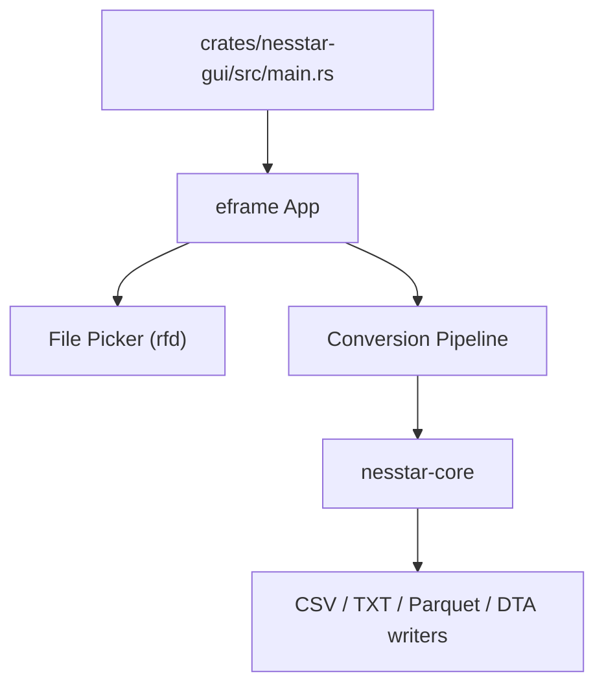

# Handoff Report: Nesstar Converter Desktop App

## Mission & Goal
Build a modern, cross-platform standalone Desktop GUI App for the `nesstar-converter` repository. The target audience is non-technical researchers who need to convert proprietary Nesstar binary survey files to open formats (CSV, Parquet, Stata, Excel, etc.) without using terminal commands.

---

## Current Status

The desktop app has been rewritten from Python/PySide6 to native Rust using eframe/egui. It ships as a single binary (~16 MB) with no runtime dependencies.

### Platforms
| Platform | Artifact | Install Method |
|---|---|---|
| **Windows** | `NesstarConverter.exe` (zip) | Unzip and run |
| **Linux** | `.deb` package | Double-click or `sudo dpkg -i` |
| **Linux** | `.tar.gz` | Extract and run |
| **macOS** | `.app` bundle (zip) | Unzip and drag to Applications |

### Features
- Drag-and-drop or file-picker for `.Nesstar` files
- DDI XML auto-detection
- Multi-format output: CSV, tab-separated text, Parquet, Stata DTA
- Brand sidebar with builder credits and sponsor links
- Progress indicators and error reporting

---

## Technical Architecture

### Crate Structure
- **`nesstar-core`**: Core parser, DDI reader, byte decoding, format writers
- **`nesstar-cli`**: CLI wrapper for scripting and automation
- **`nesstar-gui`**: Desktop GUI built with eframe 0.33.0 and glow renderer

---

## Build & Release

CI/CD is handled by [`.github/workflows/build-gui.yml`](.github/workflows/build-gui.yml). Pushing a `v*` tag triggers:
1. macOS build (Apple Silicon)
2. Linux build (x86-64) + `.deb` packaging
3. Windows build (x86-64)
4. GitHub Release with all artifacts attached

---

## Legacy PySide6 App

The original Python/PySide6 GUI remains in the `gui/` directory for reference. It is superseded by the Rust GUI and is no longer built or distributed.

Key differences:
| Dimension | PySide6 (legacy) | Rust/eframe (current) |
|---|---|---|
| Binary size | ~250 MB | ~16 MB |
| Runtime | Requires Python | Standalone |
| Framework | PySide6/Qt | eframe/egui |
| Platforms built | macOS, Linux | macOS, Linux, Windows |
